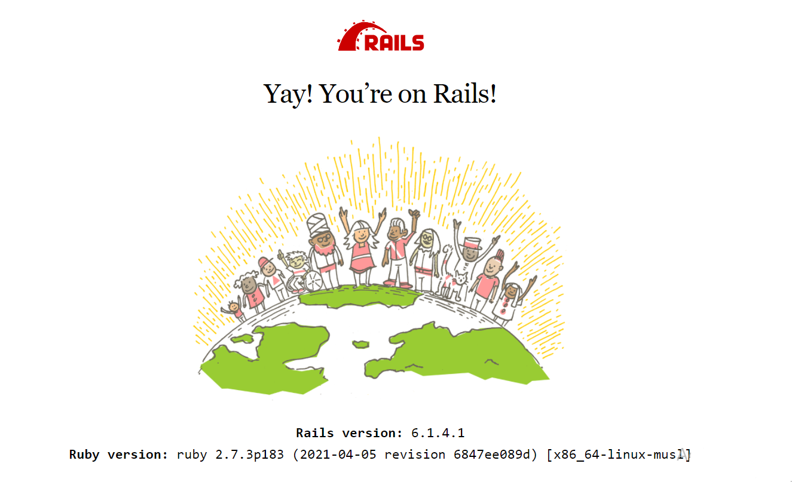

# TWITTER DEMO

TwitterDemo is a simpler version of Twitter

## Before starting!

1. Download the required files for Ruby on Rails

2. Open the folder in a code editor (VS Code)

3. Create a .env file and fill it with your github credentials as it is shown:

   - GIT_USER_NAME=my_username
   - GIT_USER_EMAIL=my_mail
   - DB_HOST=YourFolderName_db_1

4. In VS Code terminal run docker command

   ```
   docker-compose up
   ```

5. In a different terminal run docker command

   ```
   docker compose exec client bash
   ```

6. In order to install rails, run the ruby command in the same terminal

   ```
   gem install rails
   ```

   , you will know everything is ok, if you are able to run

   ```
   rails -v
   ```

   on the terminal.

7. Run

   ```
   bootstrap
   ```

   to avoid having to rewrite your credentials when commit.

8. Now with rails installed, you could create your rails app by running

   ```
   rails new . --database=postgresql --skip-test
   ```

9. To install your ruby gems run

   ```
   bundle install / bundle update
   ```

10. Don't forget to update your database.yml file. Change your default section host atributte and your development section database. You could see what database your have to write in the first terminal you opened then run

    ```
    rails db:create
    ```

11. Run

    ```
    yarn install --check-files
    ```

    to avoid errors.

12. If everything went fine, you could run this

    ```
    rails s -b 0.0.0.0
    ```

    then, you will be able to see in your browser at http://localhost:3000 the following message:

    
